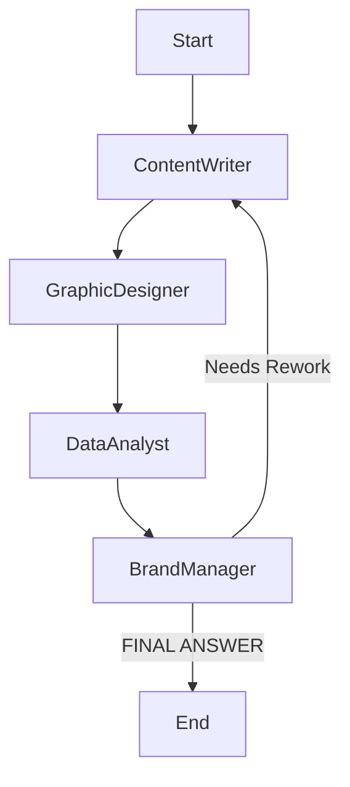

# 🧠 ZClap: AI-Powered Campaign Assistant

> A multi-agent LLM system that generates smart, creative, and data-driven marketing campaigns using LangGraph, LangChain, and Streamlit.

 <!-- Replace this with your actual screenshot -->

---

## 🚀 What Does ZClap Do?

ZClap is your **AI-powered marketing team** in a box.

Provide:
- 📦 Product name  
- 📝 Description  
- 🎯 Target audience  
- 💰 Campaign budget  

ZClap simulates a full team — Content Writer, Graphic Designer, Data Analyst, and Brand Manager — to produce a complete marketing campaign that includes:
- Catchy slogans & tone  
- Visual identity suggestions  
- Trend + market validation  
- Budget distribution  
- Influencer strategy  
- Timeline  
- KPIs & more

---

## 🧠 How It Works – LangGraph Architecture

ZClap uses **LangGraph**, a framework built on LangChain for multi-agent workflows.  
It defines a structured graph where each agent contributes step-by-step and loops continue until the Brand Manager produces a final answer.

### 🧩 Agent Collaboration Flow


## 🧑‍💼 The Agents and Their Tools

### ✍️ Content Writer  
**Role:** Creative copywriting  
**Tools:**
- `RewriteTone` – rewrite text based on tone, product, and audience  
- `CopyInspo` – fetch ad slogans from Wikiquote  

---

### 🎨 Graphic Designer  
**Role:** Visual brand identity  
**Tools:**
- `PaletteGenerator` – suggest color palette by emotion  
- `FontSuggester` – suggest fonts by brand voice  

---

### 📊 Data Analyst  
**Role:** Validate ideas using real-world data  
**Tools:**
- `TrendData` – check keyword popularity with Google Trends  
- `Search` – perform external research for latest articles and trends  

---

### 🧠 Brand Manager  
**Role:** Final evaluator & decision maker  
**Tools:**
- `BrandBookReader` – summarize a PDF brand guideline (if uploaded)  
- Outputs a final structured campaign in 10 sections  

---

## ⚙️ Technologies Used

| Tool/Library       | Purpose                                   |
|--------------------|-------------------------------------------|
| **LangGraph**       | Agent coordination workflow               |
| **LangChain**       | LLM + tool interface                      |
| **Google Gemini API** | LLM for reasoning                         |
| **Streamlit**       | Interactive frontend                      |
| **pytrends**        | Scrape Google Trends data                |
| **BeautifulSoup**   | Scrape slogans from Wikiquote             |
| **pdfplumber**      | Extract text from brand books (PDFs)      |

---

## 📁 File Structure

```bash
zclap-campaign-bot/
├── campaign_tools.py        # Tools given to each agent
├── zclap.py                 # LangGraph architecture & agent logic
├── app.py                   # Streamlit frontend
├── .env                     # API keys and config
├── assets/
│   └── screenshot.png       # App screenshot (optional)
└── README.md                # You're here!
```
---

## ⚙ Installation & Setup

### 📦 Prerequisites

- Python 3.8 or higher
- API keys for:
  - Google Generative AI
  - TavilySearch

### 🔧 Setup Steps

```bash
# Step 1: Install dependencies
pip install -r requirements.txt

# Step 2: Create a .env file and add the following:
# GOOGLE_API_KEY=your_google_api_key
# TAVILY_API_KEY=your_tavily_key

# Step 3: Run the app
streamlit run app.py

```
---
